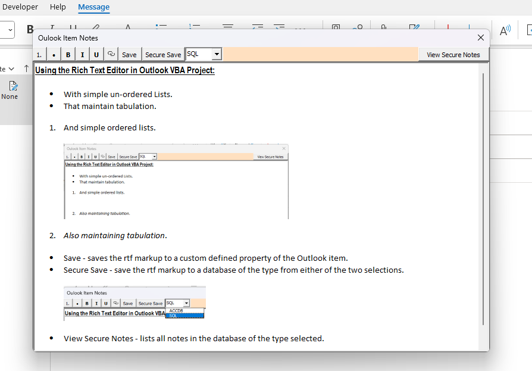
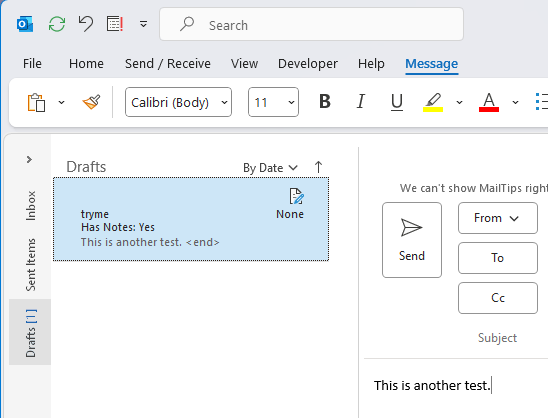
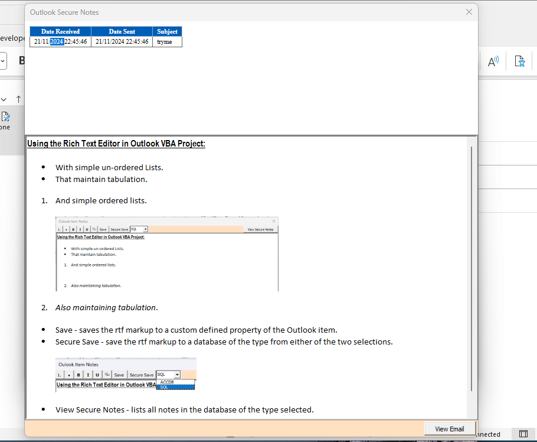
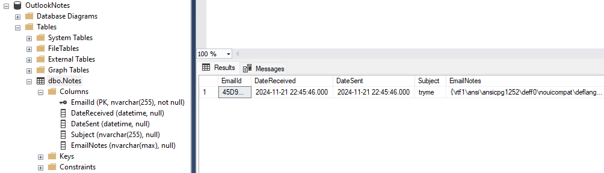

# IPI Oulook Notes

In work meetings I often wanted to add notes to Outlook items being the focus of discussion. Unfortunately, it was not a feature Microsoft had added and many Google searches indicated that it is wanted by a lot of people. A few of those wanting the ability to embed notes securely so that only they could see the notes content.

## How to Install

The easiest way to get up and running is to copy the VbaProject.OTM to your %appdata%\Microsoft\Outlook folder if you don't already have any VBA Code in your Outlook VBA Project. The other way is to import each of the VBA Forms/Modules into your VBA Project. Copy the jQuery file to a location and edit the VBA Project function jScript

Then add an Outlook Ribbon item pointed at the sub addEmailNotes and save the database files to a secure location (ensuring to alter the VBA function getDocsFolder to point at that location).

## Adding and Updating Notes

- Clicking Save or Secure Save in the Editor window when there is text and/or images will save the rtf code to either the Outlook item custom defined properties or a secure database.

    

- Clicking Save or Secure Save in the Editor window when all text and/or images have been removed will delete the values/ records in the custom defined properties or secure database.
- The Outlook item will also have a custom defined property names Has Notes, which you can add to the column view.

    

- Click the View Secure Notes with the correct database type selected to view a list of all notes in that database.

    

- Double Clicking a list item will display that note by either reading from the custom defined property or retrieving it from the database using the Email ID.

    

- Clicking the View Email button will run an Outlook Advanced search for that email where the Email ID can be found in the custom defined property and display that Outlook item.
- On opening the Add Notes Editor, the Notes for that Outlook item will be retrieved and displayed if they exist.
